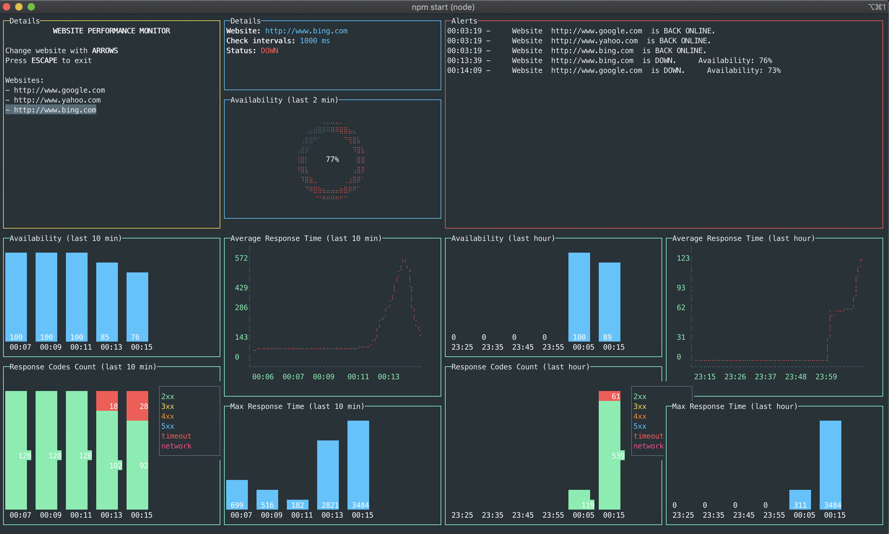

# Website Performance Monitor



## Description
Console program to monitor performance and availability of websites (coding challenge proposed by Datadog).

## Installation
You will need to install [Node.js](https://nodejs.org) and [NPM](https://www.npmjs.com/) to run the app.

```bash
cd website-performance-monitor
npm install
npm start
```
You will then be prompted what websites you want to monitor.

## Tests 
The tests are written and run with [Chai](https://www.chaijs.com/) and [Mocha](https://mochajs.org/).

To run the tests, enter the following command:

```bash
cd website-performance-monitor
npm test
```

## Possible improvements

- **Input sanitization:** Verify and sanitize the websites url / check intervals.
- **Responsive layout:** Make a responsive layout instead of just shrinking it to the window size.
- **Dynamically add website:** Add an option to dynamically add/remove websites when the program is started.
- **More customization:** Let the user customize the alert threshold, or even the layout and metrics he wants to see.
- **Store metrics in a database:** If we want to add more websites and keep an history, we should definitely use a DB.
- **Make a better UI:** This UI gets quickly limited when we want to monitor many websites at the same time.
we could try creating a new UI that allows the user to see the metrics of different websites *at the same time*.
- **Monitor all routes:** Instead of simply monitoring a single route for a website, monitor all routes at the same time
and summarize the analytics.
- **Notifications:** Notify the user (by email for example) when the website goes down.
-- **Replicate:** Replicate the monitoring app over different servers in order not to be affected by Network/DNS errors.
